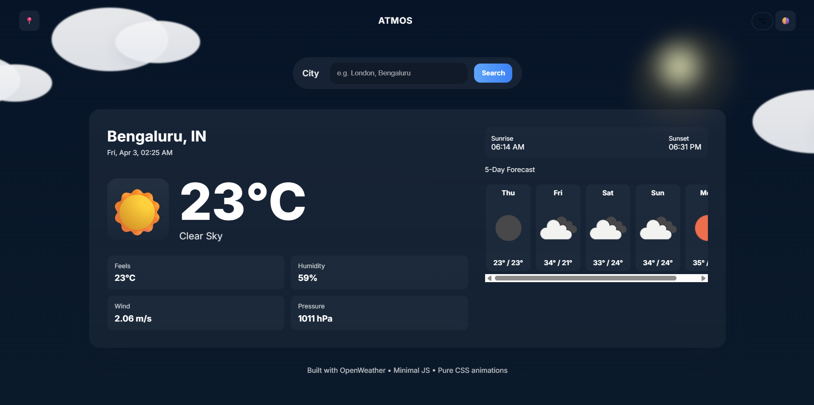

# 🌦️ Atmos — Weather App

Atmos is a modern, responsive weather application that provides real-time weather data and a 5-day forecast using the OpenWeather API.

Designed with a clean UI and smooth animations, the app dynamically adapts its theme based on day and night conditions for an immersive user experience.

---

## 🚀 Features

* 🌍 Search weather by city name
* 🌡️ Real-time temperature, humidity, wind, and pressure
* 📅 5-day weather forecast
* 🌞 Dynamic **day/night theme switching**
* 🎨 Smooth UI with modern design and animations
* 📱 Fully responsive layout

---

## 🛠️ Tech Stack

* HTML
* CSS
* JavaScript
* OpenWeather API

---

## ⚙️ How It Works

1. User enters a city name
2. App fetches data from OpenWeather API
3. Displays:

   * Current weather conditions
   * Temperature & metrics
   * 5-day forecast
4. Automatically adjusts UI:

   * 🌞 Light theme (day)
   * 🌙 Dark theme (night)

---

## 📷 Demo / Preview

<p align="center">
  
</p>

---

## 🔧 Setup Instructions

```bash id="8rjkl2"
git clone https://github.com/rabbanikhalid/weather-app-atmos
cd weather-app-atmos
open index.html
```

---

## 💡 Future Improvements

* Add hourly weather forecast
* Detect user location automatically
* Add weather-based animations (rain, snow, etc.)
* Deploy as a PWA (Progressive Web App)

---

## 📬 Contact

* 💼 [LinkedIn](https://www.linkedin.com/in/khalid-rabbani/)
* 📧 [khalidrabbani06@gmail.com](mailto:khalidrabbani06@gmail.com)
